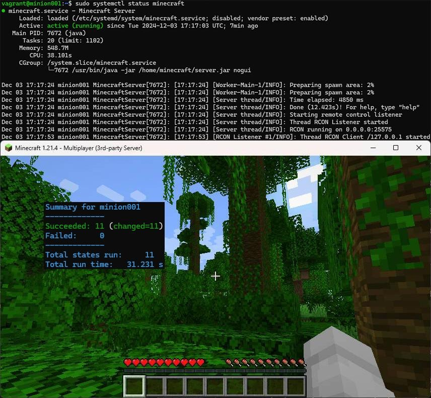
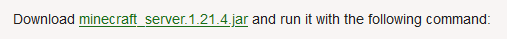
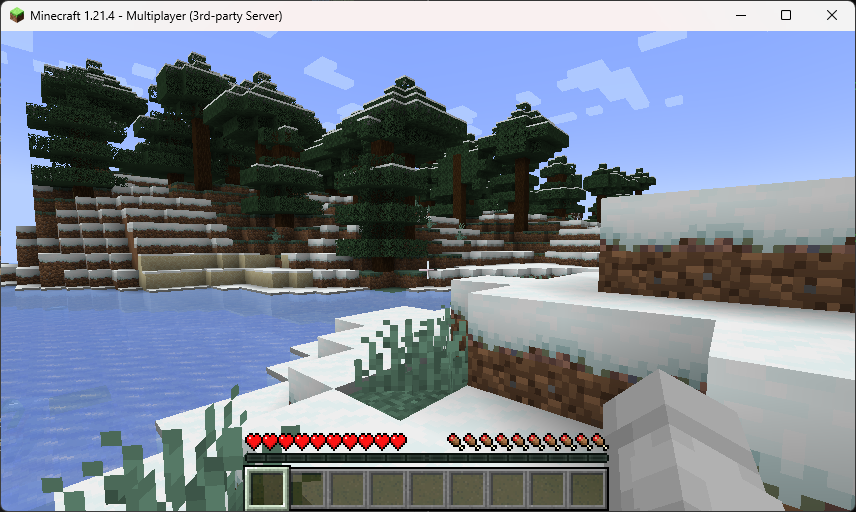

# Minecraft Salt Module

> **NOTE:** This is a student project made by [Santeri Edelmann](https://github.com/edelmeister) for the course [Configuration Management Systems 2024](https://terokarvinen.com/palvelinten-hallinta/) taught by [Tero Karvinen](https://terokarvinen.com/).

Minecraft-Salt-Module is a Salt-module that automates the installing and running of a Minecraft: Java Edition Server on a minion computer.



## Usage

This [Salt](https://docs.saltproject.io/salt/install-guide/en/latest/) module installs and runs a Minecraft: Java Edition Server as a systemd-service on a minion machine.

For installation go to [Quick Installation](#quick-installation).

This allows for centralized management of the ``server.properties`` file in the module folder, which you can and should tweak before applying the state.

Included as a submodule is [mcrcon by Tiiffi](https://github.com/Tiiffi/mcrcon) which allows for remote execution of Minecraft Server console commands on the server.

For instruction on sending Minecraft Server's console commands, go to [mcrcon's GitHub repository page](https://github.com/Tiiffi/mcrcon).

You can either SSH into your minion running the server and run ``mcrcon`` there, or you can install mcrcon to your master.

You can see the log of ``minecraft.service`` with ``journalctl -u minecraft``.

For general use of a Minecraft Server and how to setup port-forwarding etc. see the [Minecraft Wiki server setup tutorial](https://minecraft.wiki/w/Tutorial:Setting_up_a_server).

## Quick Installation

**Pre-requisites:** 
- [Salt](https://docs.saltproject.io/salt/install-guide/en/latest/)
- GNU/Linux machine with at least 2048MB of RAM

### 1. Clone minecraft-salt-minion to your master machine:

Run the following command on your master machine

```
sudo git clone --recurse-submodules https://github.com/edelmeister/minecraft-salt-module.git /srv/salt/minecraft-salt-module
```

### 2. Download the latest server.jar from Minecraft's Website

Go to https://www.minecraft.net/en-us/download/server and copy the download link to the latest ``server.jar``.



Insert the link to the following command and run it on your master

```bash
sudo wget -O /srv/salt/minecraft-salt-module/server.jar <insert-link-here>
```

For example

```bash
sudo wget -O /srv/salt/minecraft-salt-module/server.jar https://piston-data.mojang.com/v1/objects/4707d00eb834b446575d89a61a11b5d548d8c001/server.jar
```

### 3. Configure your Minecraft Server

Change the desired settings of the server in ``server.properties``. For help see the [Minecraft Wiki page](https://minecraft.wiki/w/Server.properties).

Change the default password for the remote console connection in

```ini
rcon.password=
```

### 4. Apply the Salt state

For example, if you have a minion machine:

```bash
sudo salt '*' state.apply minecraft-salt-module
```

If you want to run the server locally on the master:

```
sudo salt-call --local state.apply minecraft-salt-module
```

### 5. (OPTIONAL) Install mcrcon on your master machine

Install ``build-essential``:

```bash
sudo apt install build-essential -y
```

And run:

```bash
sudo git clone https://github.com/Tiiffi/mcrcon.git /usr/local/src/mcrcon && cd /usr/local/src/mcrcon && sudo make && sudo make install
```

Then connect you can connect ``mcrcon`` to your server with for example:

```bash
mcrcon -H 192.168.11.11 -P 25575 -p password
```

### 6. Connect to your Minecraft Server

In your Minecraft: Java Edition Client, go to __Multiplayer__ and __Direct Connection__, type in your servers address and port and click __Join Server__.

__And voilà!:__


